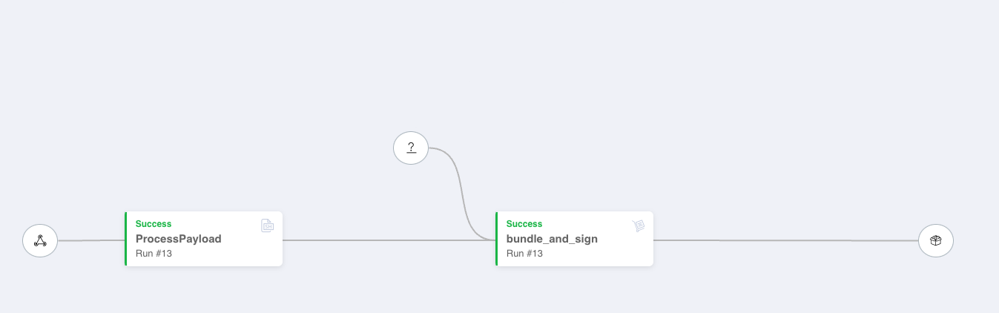
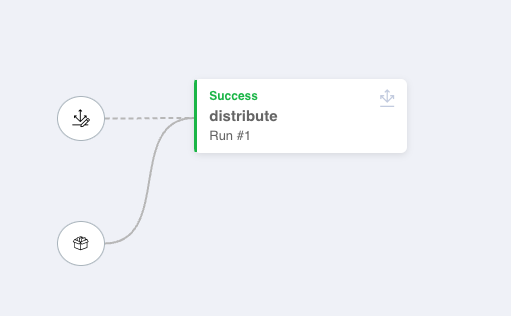

# JFrog Distribution Pipeline Sample

This repository shows an example of a JFrog Pipeline triggered by the upload of an artifact to a local Artifactory repository and that distributes such artifact to a JFrog Edge node and/or to another Artifactory instance. 

The `pipeline.yaml` definition file defines two pipeline instances:

1. one to create and sign a Release Bundle for the uploaded artifact  
   
   Each run of this pipeline is executed serially to avoid a current known issue with resources state across runs.   
      
   
   

2. the other one to distribute the release bundle to the targeted edge node (defined by the `DistributionRule` resource)   
   
   This pipeline is triggered by the `debSignedBundle` resource output created by the previous pipeline. If nodes are available, this pipeline can have multiple runs executed in parallel.   
     
    

### How to configure the pipeline 

